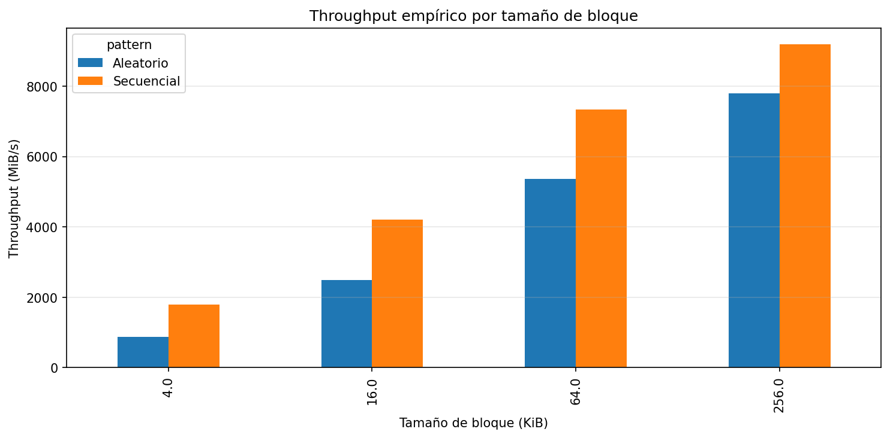
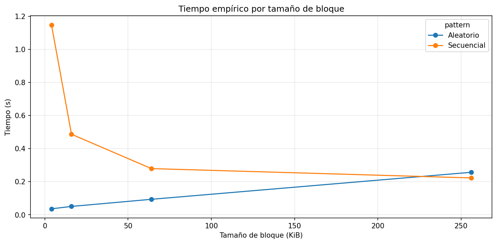
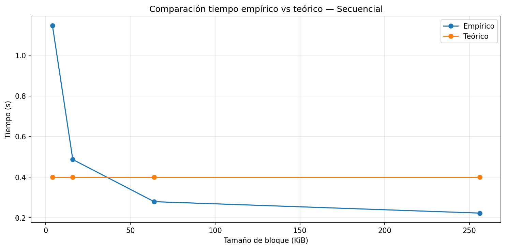
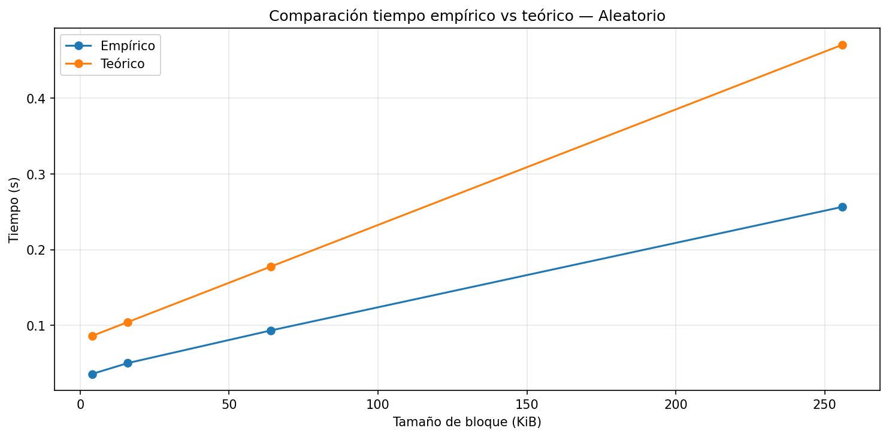
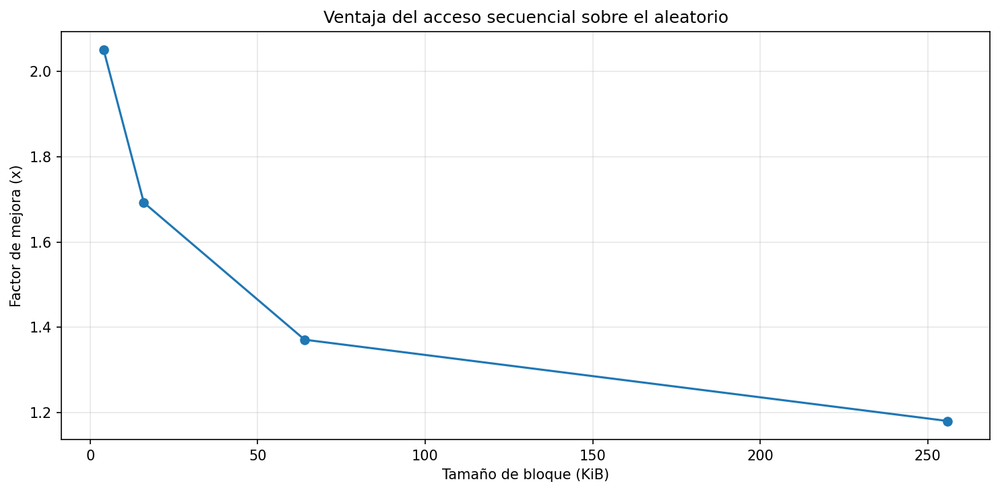

# SEC1025-lab3-IO_performance-SamuelContreras

Repositorio con la solución de la práctica 3 sobre rendimiento de E/S en disco.

## Especificaciones del Equipo de Prueba

| Parámetro | Valor |
|-----------|-------|
| Sistema Operativo | Windows 11 23H2 |
| CPU | AMD Ryzen 7 8700F (8 núcleos / 16 hilos) |
| Memoria RAM | 16 GB DDR5 |
| Tipo de Disco | HS-SSD-FUTURE Lite 512G NVMe |
| Carga de CPU en Reposo | < 7% |

### Detalle del Almacenamiento

- **Modelo:** HS-SSD-FUTURE Lite 512G  
- **Tipo:** SSD NVMe  
- **Capacidad:** 512 GB  
- **Interfaz:** PCIe  

### Nota sobre la ejecución

Todas las pruebas se ejecutaron en **entorno local** (mi PC con Windows 11), no en Google Colab. De esta forma, los resultados reflejan fielmente el rendimiento real de mi hardware (SSD NVMe, RAM DDR5, procesador Ryzen 7). Se utilizó un archivo de prueba de 2 GB para forzar la simulación de *cold cache* y evitar que el sistema operativo almacenara los datos en la RAM.

---

## Resultados del experimento

### 1. Punto de control 1 – Revisión conceptual

**1. ¿Qué representa la latencia en este laboratorio?**  
La latencia representa el tiempo de demora que tarda el disco en comenzar a entregar los datos solicitados. Es el costo fijo que se paga por cada acceso no contiguo al almacenamiento.

**2. ¿Qué representa el throughput?**  
El throughput es la velocidad de transferencia sostenida del dispositivo una vez que el acceso ya se ha establecido. Se mide en MiB/s o GB/s.

**3. ¿Por qué en acceso secuencial normalmente se asume que M ≈ 1?**  
Porque los bloques están en posiciones contiguas. Una vez que se accede al primero, el resto se lee de forma continua sin necesidad de nuevos posicionamientos.

**4. ¿Por qué en acceso aleatorio M tiende a ser mayor?**  
Porque cada bloque está en una posición dispersa, lo que obliga al controlador a reposicionarse para cada lectura, multiplicando el número de accesos no contiguos.

### 2. Punto de control 2 – Reflexión sobre la configuración

**1. Tamaño del archivo: ¿Es suficiente para superar la caché RAM?**  
Sí, con 2 GB (2048 MB) el archivo es suficientemente grande para que el sistema operativo no pueda almacenarlo completo en la caché RAM, forzando lecturas reales desde el SSD.

**2. Tamaño de bloque: ¿cuál esperaría mejor rendimiento en acceso aleatorio?**  
El bloque de 256 KB. Al ser el más grande, reduce la cantidad de accesos necesarios y amortiza mejor la latencia fija de cada operación.

**3. Entorno de ejecución**  
Local (mi PC). Esto asegura que los resultados correspondan a mi hardware real y no a servidores remotos.

### 3. Análisis después de crear el archivo de prueba

**1. ¿Qué papel cumple este archivo dentro del experimento?**  
Es el objeto de prueba sobre el cual se realizan todas las mediciones de lectura. Sin él no habría datos que leer.

**2. ¿Por qué es útil trabajar con un archivo relativamente grande?**  
Porque se asemeja a situaciones reales (bases de datos, vídeos, logs) y permite medir el rendimiento en condiciones exigentes, además de evitar que el sistema operativo lo almacene completamente en caché.

**3. ¿Qué ocurriría si el archivo fuera demasiado pequeño?**  
El sistema operativo lo almacenaría completo en la **caché de RAM**, dando resultados falsos: estaríamos midiendo la velocidad de la memoria RAM (nanosegundos) en lugar de la del disco real.

### 4. Resultados empíricos – Tabla de throughput

| Tamaño bloque | Secuencial (MiB/s) | Aleatorio (MiB/s) | Speedup (Sec/Ale) |
|---------------|--------------------|-------------------|-------------------|
| 4 KB          | 1785.42            | 870.49            | 2.05              |
| 16 KB         | 4208.87            | 2486.86           | 1.69              |
| 64 KB         | 7344.67            | 5358.01           | 1.37              |
| 256 KB        | 9198.22            | 7795.49           | 1.18              |

**Análisis:**  
- El acceso secuencial fue más rápido en todos los tamaños de bloque.  
- El throughput aumenta con el tamaño de bloque (mayor bloque, más datos por operación).  
- La mayor diferencia (2.05×) ocurre en 4 KB; con bloques grandes la ventaja se reduce.

### 5. Punto de control 3 – Modelo teórico elegido

- **Dispositivo modelado:** SSD aproximado (SSD NVMe de referencia)  
- **Latencia asumida:** 10 µs (1e-5 s)  
- **Throughput asumido:** 5 GB/s (5,368,709,120 bytes/s)

**Explicación:**  
El modelo se parece en la latencia (típica de un NVMe), pero el throughput real de mi SSD resultó ser superior (hasta 9.2 GB/s). Por tanto, el modelo es conservador y sirve como referencia conceptual, aunque no refleja la máxima velocidad de mi equipo.

### 6. Comparación teoría vs práctica

| Patrón | Tiempo empírico | Tiempo teórico | Diferencia |
|--------|----------------|----------------|------------|
| Secuencial (4 KB) | 1.147 s | 0.400 s | El modelo subestima (falta sobrecarga de operaciones) |
| Secuencial (256 KB) | 0.223 s | 0.400 s | El modelo sobreestima (SSD real más rápido) |
| Aleatorio (4 KB) | 0.036 s | 0.086 s | El modelo sobreestima (latencia real menor) |
| Aleatorio (256 KB) | 0.257 s | 0.471 s | El modelo sobreestima (throughput real mayor) |

**Factores que explican las diferencias:**  
1. Caché del sistema operativo (aunque mitigada con archivo de 2 GB).  
2. Rendimiento real del SSD superior al modelo conservador.  
3. Baja carga de CPU (<7%) que evita interferencias.  
4. El modelo no contempla la sobrecarga de realizar cientos de miles de operaciones de lectura (como en secuencial con bloque de 4 KB).

### 7. Gráficas generadas

A continuación se muestran las gráficas obtenidas del experimento. Todas se guardaron automáticamente en la carpeta `images/`.

#### Figura 1: Throughput empírico por tamaño de bloque

*Interpretación:* Las barras del acceso secuencial son más altas en todos los bloques. A mayor bloque, mayor throughput. El secuencial aprovecha mejor la lectura en bloques grandes.

#### Figura 2: Tiempo empírico por tamaño de bloque

*Interpretación:* En secuencial, el tiempo cae drásticamente al aumentar el bloque (de 1.15 s a 0.22 s). En aleatorio, el tiempo se mantiene bajo y solo sube ligeramente en bloque grande porque lee casi todo el archivo.

#### Figura 3: Comparación teoría vs práctica – Secuencial

*Interpretación:* El modelo teórico es constante (0.4 s), mientras que la práctica muestra tiempos muy altos en bloque pequeño (sobrecarga) y mejora hasta ser más rápido que el modelo en bloque grande.

#### Figura 4: Comparación teoría vs práctica – Aleatorio

*Interpretación:* Las curvas tienen tendencia similar (lineal creciente), pero los tiempos empíricos son siempre menores que los teóricos, indicando que mi SSD es más rápido que el modelo de referencia.

#### Figura 5: Ventaja del acceso secuencial (speedup)

*Interpretación:* El mayor speedup (2.05×) ocurre en bloque de 4 KB. La ventaja disminuye al aumentar el bloque, hasta 1.18× en 256 KB.

### 8. Preguntas de cierre (respuestas completas)

**1. Comparación de patrones: ¿cuántas veces más rápido fue el acceso secuencial respecto al aleatorio en su equipo? ¿Ese resultado era el esperado según la teoría?**  

El acceso secuencial fue más rápido en todos los tamaños de bloque. La mayor diferencia la encontré con bloque de 4 KB, donde el secuencial fue **2.05 veces más rápido** (1785 MiB/s frente a 870 MiB/s). Con bloque de 256 KB la ventaja se redujo a solo 1.18 veces (9198 MiB/s frente a 7795 MiB/s). Este resultado era esperado según la teoría, porque el acceso secuencial minimiza la cantidad de operaciones de búsqueda o latencias del controlador, mientras que el aleatorio paga ese costo por cada bloque. Lo que no esperaba es que la diferencia fuera tan grande en bloques pequeños, debido a la sobrecarga de realizar más de medio millón de operaciones de lectura.

**2. Efecto del tamaño de bloque: ¿Qué ocurrió con el throughput del acceso aleatorio a medida que aumentó el tamaño de bloque? ¿Por qué cree que sucede eso?**  

El throughput del acceso aleatorio aumentó significativamente al incrementar el tamaño de bloque. Pasó de 870 MiB/s con bloque de 4 KB a 7795 MiB/s con bloque de 256 KB. Esto sucede porque con bloques más grandes se transfieren más datos por cada operación de lectura, reduciendo la cantidad total de accesos aleatorios necesarios para leer la misma cantidad de información. Como cada acceso aleatorio tiene un costo fijo (latencia del controlador), al hacer menos accesos se amortiza mejor ese costo y el throughput se acerca al del acceso secuencial.

**3. Teoría vs práctica: Identifique un caso en sus resultados donde la medición empírica se alejó del modelo teórico. ¿A qué factor atribuye esa diferencia?**  

El caso donde la medición empírica más se alejó del modelo teórico fue en el acceso secuencial con bloque de 4 KB. El modelo teórico predecía un tiempo de 0.40 segundos, pero el tiempo real fue de 1.15 segundos, casi tres veces más lento. Atribuyo esta diferencia a que el modelo teórico simplifica demasiado el costo de las operaciones: asume que leer un archivo de 2 GB siempre toma lo mismo independientemente del tamaño de bloque, pero en la práctica, usar bloques muy pequeños (4 KB) implica una enorme cantidad de operaciones de lectura (524,288 operaciones). Cada una de esas operaciones tiene una sobrecarga propia (llamadas al sistema, gestión del búfer, etc.) que el modelo no contempla. En cambio, con bloques grandes el modelo se acerca más a la realidad.

**4. Tipo de disco: Compare sus resultados con los valores de referencia de la tabla de la guía. ¿Su equipo se comportó como un HDD, un SSD SATA o un SSD NVMe?**  

Comparando mis resultados con la tabla de referencia de la guía, mi equipo se comportó claramente como un **SSD NVMe de gama alta**. El throughput secuencial que medí alcanzó los 9198 MiB/s (unos 9.2 GB/s), muy por encima de los 500 MB/s de un SSD SATA y muchísimo más que los 100-150 MB/s de un HDD. La latencia también es consistente con un NVMe, ya que las operaciones aleatorias fueron muy rápidas (fracciones de segundo). Incluso superé el valor de referencia de 5 GB/s que la guía asigna a un SSD NVMe, lo que indica que mi disco es de gama alta.

**5. Aplicación práctica: Imagine que debe almacenar una tabla de estudiantes con 1 millón de registros. Con base en lo que midió, ¿preferiría leerla toda de forma secuencial o acceder a registros individuales de forma aleatoria? ¿Por qué?**  

Si tuviera que almacenar una tabla de estudiantes con 1 millón de registros, preferiría leerla toda de forma **secuencial** con bloques grandes (256 KB o más). Mis mediciones muestran que el acceso secuencial es significativamente más rápido (hasta 9.2 GB/s). Leer toda la tabla de una vez me permitiría aprovechar el throughput máximo de mi SSD y procesar los datos en memoria. En cambio, acceder a registros individuales de forma aleatoria implicaría muchas operaciones de búsqueda, lo que multiplicaría la latencia y haría la operación mucho más lenta, aunque usara índices. Por supuesto, si solo necesito unos pocos registros, el acceso aleatorio es inevitable; pero si la tarea es recorrer toda la tabla o la mayor parte de ella, el secuencial es la mejor decisión de diseño.

### 9. Conclusión final

La información en un disco se almacena en bloques que pueden estar contiguos o dispersos. Esto importa porque la disposición física afecta drásticamente el rendimiento: el acceso secuencial lee bloques seguidos sin pausas, mientras que el aleatorio obliga a saltar, pagando una latencia por cada salto. Incluso en un SSD, que no tiene partes móviles, esta diferencia existe porque el controlador tiene un costo fijo por operación. En mis mediciones, el acceso secuencial fue hasta **2.05 veces más rápido** que el aleatorio (en bloque de 4 KB), y el throughput secuencial alcanzó los **9198 MiB/s** con bloque de 256 KB.

El modelo teórico (10 µs, 5 GB/s) predijo razonablemente el comportamiento aleatorio, pero falló en el secuencial con bloques pequeños porque no considera la sobrecarga de miles de operaciones. Mi SSD real resultó ser más rápido que el de referencia, mostrando que el modelo es conservador.

Con base en estos resultados, si diseñara un sistema real (por ejemplo, una base de datos), tomaría dos decisiones: (1) almacenar los datos de forma contigua siempre que sea posible para aprovechar el acceso secuencial; (2) utilizar bloques grandes (256 KB o más) para minimizar el impacto del acceso aleatorio cuando este sea inevitable. Estas estrategias permiten acercar el rendimiento del acceso aleatorio al secuencial y obtener el máximo provecho del hardware disponible.

---